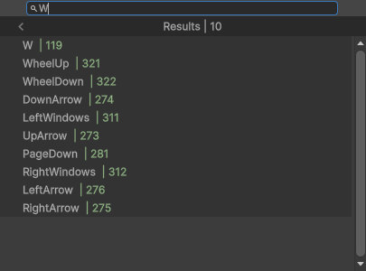

# BXSearchDropdown

This is an unity engine extension that adds an IMGUI utility, which is an alternative to `UnityEditor.IMGUI.Controls.AdvancedDropdown`

Features:
* Async searching, typing a query doesn't block the main editor thread.
* Basic string normalization and result sorting.
* Override GUI behavior and bind extra data per `SearchDropdownElement`
* Faster, more modular and open source

### Compatibility
Works with Unity Version >=2021.3. <br/>
Please note that some versions of Unity 6 may have bugs related to IMGUI. If you encounter this, please downgrade or upgrade to a version that works.

## Demo

**TypeSelectorDropdown** <br/>


**KeyCodeSelectorDropdown** (with a query showing the sorting) <br/>


**Compared to normal dropdown** <br/>


**Compared to `AdvancedDropdown`** (on many elements/items) <br/>


## Basic Usage
You can replicate or inspect these code snippets to get started:

### ./Scripts/Editor/ExampleDropdown.cs
```cs
// Assembly-CSharp-Editor
using UnityEngine;
using UnityEditor;
using BX.Editor;

public class ExampleDropdown<T> : SearchDropdown<T> where T : ISearchDropdownWindow, new()
{
    // Alternatively, you can create your own inheriting class to bind extra data to your Element
    public class Item : SearchDropdownElement
    {
        // Though a constructor definition (to call any of the base constructor with string) is necessary.
        public readonly float extraData;

        public Item(float extraData) : base($"{extraData} <color=#a8d799> | {((long)extraData):X}</color>")
        {
            this.extraData = extraData;
        }
        public Item(float extraData, string label) : base(label)
        {
            this.extraData = extraData;
        }
    }

    protected override SearchDropdownElement BuildRoot()
    {
        // Create a root element to return
        // Other elements are to be attached to this root
        SearchDropdownElement root = new SearchDropdownElement("Root Element")
        {
            // Any element can be started as a c# collection
            new SearchDropdownElement("Child 1"),
            new SearchDropdownElement("Child 2"),
            new SearchDropdownElement("Child 3")
            {
                // Every child can have it's own values and so on...
                new SearchDropdownElement("Child Of Child 1"),
                new SearchDropdownElement("Child Of Child 2")
                {
                    new Item(42.0f, "Value of 42"),
                    new Item(float.Epsilon)
                }
            }
        };
        // The children can be also systematically be added using SearchDropdownElement.Add()
        // Basically a 'SearchDropdownElement' is an ICollection of 'SearchDropdownElement'
        // Which technically is a tree data type. (or not, you are reading the sample written by the guy who failed DSA after all)
        
        // Return the root after creating it, this is required as a part of the abstract class 'SearchDropdown'.
        return root;
    }
}
```

### ./Scripts/SampleClass.cs
```cs
// Assembly-CSharp
using UnityEngine;

public class SampleClass : MonoBehaviour
{
    public string dropdownSettingString;
}
```

### ./Scripts/Editor/SampleClassEditor.cs
```cs
// Assembly-CSharp-Editor
using UnityEngine;
using UnityEditor;
using BX.Editor;

[CustomEditor(typeof(SampleClass))]
public class SampleClassEditor : Editor
{
    // Unity gives a dummy rect on the Event.current.type == EventType.Layout
    private Rect lastRepaintDropdownParentRect;

    public override void OnInspectorGUI()
    {
        var target = base.target as SampleClass;    

        // Draw the private 'm_Script' field (optional)
        using (EditorGUI.DisabledScope scope = new EditorGUI.DisabledScope(true))
        {
            EditorGUILayout.PropertyField(serializedObject.FindProperty("m_Script"));
        }
        
        // Draw the dropdown button
        EditorGUILayout.BeginHorizontal();
        EditorGUILayout.LabelField("Dropdown Setting String", GUILayout.Width(EditorGUIUtility.labelWidth));
        if (GUILayout.Button($"Value : {target.dropdownSettingString}", EditorStyles.popup))
        {
            ExampleDropdown<UGUISearchDropdownWindow> dropdown = new();
            dropdown.Show(lastRepaintDropdownParentRect);
            dropdown.OnElementSelectedEvent += (SearchDropdownElement element) =>
            {
                // Will not take a 'SerializedProperty' inside a delegate
                // Because SerializedObject and SerializedProperty disposes automatically after the OnGUI call
                // But you can clone the entire SerializedObject and SerializedProperty just for this delegate, 
                // then apply changed values and dispose of it inside this delegate when done (manually managing it's lifetime)
                // -- 
                // For this example, a basic undo with direct access to the object is used
                Undo.RecordObject(target, "set value from dropdown");
                // You can create custom Element/Item classes that inherit from 'SearchDropdownElement' and type test it to get it's values.
                // With this, you can test/unbox the type like `if (element is ExampleDropdown<UGUISearchDropdownWindow>.Item item)` and get the extra data.
                // For now we are just assigning the content text set to the element for simplicity.
                target.dropdownSettingString = element.content.text;
            };
        }
        // Get the last rect for getting the proper value
        // This is only needed on automatically layouted GUI's, with the GUI's
        // that you know the rect to you can use that rect instead.
        // (as the rect of GetLastRect() becomes `Rect.kDummyRect` during certain events that trigger the dropdown)
        if (Event.current.type == EventType.Repaint)
        {
            lastRepaintDropdownParentRect = GUILayoutUtility.GetLastRect();
        }
        EditorGUILayout.EndHorizontal();
    }
}
```

---
You can also optionally create an attribute + `CustomPropertyDrawer` for the dropdown:

### ./Scripts/SampleTargetAttribute.cs
```cs
using System;

[AttributeUsage(AttributeTargets.Field, AllowMultiple = false, Inherited = true)]
public class SampleTargetAttribute : Attribute { }
```

### ./Scripts/Editor/SampleTargetPropertyDrawer.cs
```cs
using UnityEditor;
using UnityEngine;
using BX.Editor;

[CustomPropertyDrawer(typeof(SampleTargetAttribute))]
public class SampleTargetPropertyDrawer : PropertyDrawer
{
    private const float WarningBoxHeight = 22f;
    private const float YMargin = 2f;
    private bool propertyTypeIsValid = false;

    public override float GetPropertyHeight(SerializedProperty property, GUIContent label)
    {
        float addHeight = 0f;

        propertyTypeIsValid = property.propertyType == SerializedPropertyType.String;
        addHeight += propertyTypeIsValid ? (EditorGUIUtility.singleLineHeight + YMargin) : WarningBoxHeight;

        return addHeight;
    }

    public override void OnGUI(Rect position, SerializedProperty property, GUIContent label)
    {
        label = EditorGUI.BeginProperty(position, label, property);
        position.height -= YMargin;
        position.y += YMargin / 2f;

        if (propertyTypeIsValid)
        {
            string value = property.stringValue;

            // Draw a dropdown selector with label
            // Label
            Rect labelRect = new Rect(position.x, position.y + (YMargin / 2f), EditorGUIUtility.labelWidth, EditorGUIUtility.singleLineHeight);
            EditorGUI.LabelField(labelRect, label);

            // Dropdown
            bool previousShowMixed = EditorGUI.showMixedValue;
            EditorGUI.showMixedValue = property.hasMultipleDifferentValues;
            // Adding margin to the 'dropdownRect's y coordinate causes it to be off center on DropdownButton
            Rect dropdownRect = new Rect(position.x + labelRect.width, position.y, Mathf.Max(position.width - labelRect.width, EditorGUIUtility.fieldWidth), EditorGUIUtility.singleLineHeight);
            if (EditorGUI.DropdownButton(dropdownRect, new GUIContent(value, label.tooltip), FocusType.Keyboard))
            {
                // Display a 'KeyCode' selector
                ExampleDropdown<UGUISearchDropdownWindow> selector = new();
                selector.Show(dropdownRect);

                SerializedObject copySo = new SerializedObject(property.serializedObject.targetObjects);
                SerializedProperty copySetProperty = copySo.FindProperty(property.propertyPath);
                selector.OnElementSelectedEvent += (SearchDropdownElement element) =>
                {
                    copySetProperty.stringValue = item.content.Text;
                    copySo.ApplyModifiedProperties();

                    copySetProperty.Dispose();
                    copySo.Dispose();
                };
                selector.OnDiscardEvent += () =>
                {
                    copySetProperty.Dispose();
                    copySo.Dispose();
                };
            }
            EditorGUI.showMixedValue = previousShowMixed;
        }
        else
        {
            EditorGUI.HelpBox(position, "Type isn't valid. Please use this on `string` fields.", MessageType.Warning);
        }

        EditorGUI.EndProperty();
    }
}
```
And then apply to any field with type `string` to display the `SampleDropdown<T>` that we have made.
### ./Scripts/SampleClassFieldAttr.cs
```cs
using UnityEngine;

public class SampleClassFieldAttr : MonoBehaviour
{
    [SampleTarget] public string dropdownSettingString;
}
```

## TODO
* [ ] Decouple the backing API to not rely on `UnityEngine` namespace
* [ ] Other `SearchDropdownWindow` versions for other frameworks
